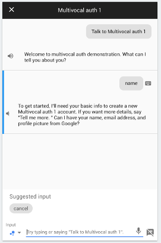
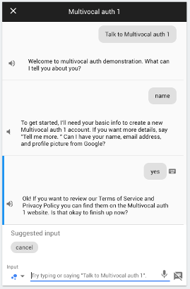
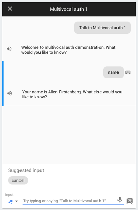

# multivocal-example-auth1

This project is a demonstration about how to use multivocal to do 
authentication with Actions on Google and Google Sign In.

This very specifically describes *authentication*, **not** *authorization*.
Although the two are related, and authorization depends on authentication,
we're just looking at the first part right now.

Specifically, our goal here is to be able to get a Google Identity Token
using Google Sign In for the Assistant.

## Before you code

Before you begin coding, there is a bit of setup you'll need to do

### Prerequisites

* A project in the Action Console.
* We will use Firebase Cloud Functions
    * Changes for Google Cloud Functions, AWS Lambda,
        or other node.js hosting platforms are minimal. See multivocal
        documentation for details.
* For this example, check the project out from github:
     `git clone https://github.com/afirstenberg/multivocal-example-auth1.git`

### Setup Actions on Google

1. In the Actions on Google console, you'll select the Account linking
    left navigation (possibly scrolling to the bottom to get to it).
    
    
    
2. Expand the Account Creation section and set "Yes, allow users to sign up for 
    new accounts via voice".
    
    
    
3. Expand the Linking Type section and make sure that "Google Sign In"
    is selected.
    
    
    
4. Expand the Client Information section. You will see a Client ID field with
    information you'll need to add to your multivocal configuration.
    
    
        
## Write and Configure your Action

The Action is a fairly simple one (and, if you've done the auth0 example,
a very familiar one). After starting, you'll be prompted
if you want to hear the name or the email address that it has for you.
So our two intents are

* user.email
* user.name

### Additional Dialogflow intents

Make sure you have already loaded the multivocal standard intents.

To load the additional intents for this Action, click on the gear
to open the project settings and select "Export and Import" then
"Import From ZIP".

**IMPORTANT** Make sure you "Import" the zip file, not "Restore".
Importing the file will add it to other intents that are already
defined.


The intents to import are under `dialogflow/multivocal-example-auth0.zip`.
Select this, type "IMPORT" into the text field, and click on the "Import"
button. Then save.


### index.js

Turning to the code, our index file is
fairly straightforward and minimalist. Most of the work will be done
in the `config.js` file, which gets initialized here.

```
const Multivocal = require('multivocal');

require('./config.js').init();

exports.webhook = Multivocal.processFirebaseWebhook;
```

### config.js

The important bits are all in the configuration file. We won't go into
everything, but a few important things to note. (Again, if you've done
the auth0 example, you'll notice that things are very similar, but there
are a few differences we'll point out.)

In multivocal, we say that it is a "reqiurement" to be authenticated
before we get the results for some intents. So we define them in
the configuration under `Local/und/Requirements`. Requirements can
be localized, although they often aren't, so we include them in the
"und" section.

We have two intents that need the user to be authenticated, "user.name"
and "user.email". So our requirements section includes them and says
that the environment setting `User/IsAuthenticated` must be set.

```
  "Intent.user.email": "User/IsAuthenticated",
  "Intent.user.name":  "User/IsAuthenticated"
```

`User/IsAuthenticated` will only be set if either the auth token or the
identity token have been set, and multivocal knows to prompt the user
to sign in to get this set.

In our responses, we'll include values from the `User/Profile`
environment setting, which is set by the auth0 builder.

```
  "Intent.user.email": [
    "Your email address is {{User.Profile.email}}."
  ],
  "Intent.user.name": [
    "Your name is {{User.Profile.name}}."
  ]
```

Google Sign In support is built-in to multivocal, so we just need to set
the Client ID so we can validate the token that Google sends.
We need to set what fields we want to confirm for the issuer. The issuer,
in this case, is `https://accounts.google.com` and the field that contains
the Client ID is the `aud` field. So our validation object looks something
like

```
var validate = {
  "https://accounts.google.com":{
    // The Client ID issued in Account Linking -> Client information
    "aud": "PUT YOUR CLIENT ID HERE"
  }
};

``` 
 
We'll put
this in `Config/Setting/Requirements/Auth` in the environment:

```
  Setting:{
    Requirements:{
      Auth: validate
    }
  }
```


## Trying it out

One great thing about doing Google Sign In for the Assistant is that the
user can do it from a smart speaker such as Google Home - they won't need
to go to their phone to complete log in. 

To test this, make sure you've
selected the speaker icon in the simulator.


We start the Action by explicitly asking for it, and then asking
for my name.

Since our account isn't yet linked, it asks for permission to begin
the linking process.



We'll say "yes", and it prompts if it is ok to finish the linking



We'll say "yes" again, and it will confirm the account is linked and then
return us to the action, where it completes the intent we originally asked
about and gives us our name.


If we quit the Action and start over, we'll see that the Assistant
still knows who we are. So when we ask for our name, it doesn't require
that we log in.


